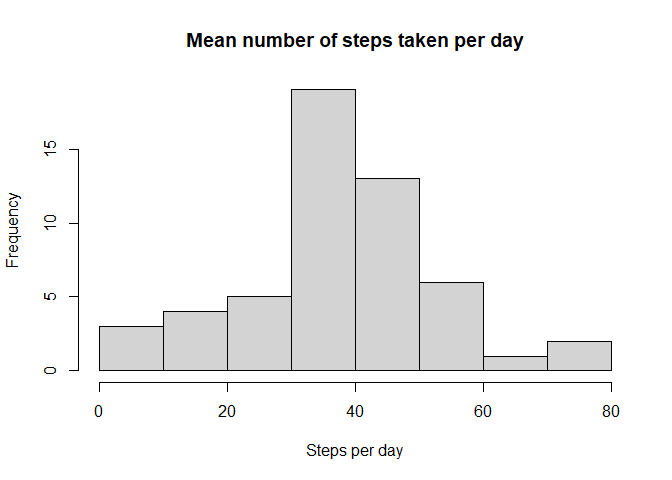

```r
require(tidyverse)
```

```
## Loading required package: tidyverse
```

```
## -- Attaching packages ------------------ tidyverse 1.3.0 --
```

```
## v ggplot2 3.3.2     v purrr   0.3.4
## v tibble  3.0.3     v dplyr   1.0.1
## v tidyr   1.1.1     v stringr 1.4.0
## v readr   1.3.1     v forcats 0.5.0
```

```
## -- Conflicts --------------------- tidyverse_conflicts() --
## x dplyr::filter() masks stats::filter()
## x dplyr::lag()    masks stats::lag()
```

```r
require(dplyr)
require(ggplot2)
require(lubridate)
```

```
## Loading required package: lubridate
```

```
## 
## Attaching package: 'lubridate'
```

```
## The following objects are masked from 'package:base':
## 
##     date, intersect, setdiff, union
```


## Loading and preprocessing the data

```r
# read data
unzip("activity.zip")
activitydata <- read_csv("activity.csv")
```

```
## Parsed with column specification:
## cols(
##   steps = col_double(),
##   date = col_date(format = ""),
##   interval = col_double()
## )
```

```r
activitydata$date <- 
        activitydata$date %>%
        ymd() # make date the correct format with lubridate

# group by date
activitydata <- group_by(activitydata, date)

# get mean no. of steps per date
steps_day <- 
        summarise(activitydata, 
                  mean = mean(steps, 
                              na.rm = TRUE))
```

```
## `summarise()` ungrouping output (override with `.groups` argument)
```
## What is mean total number of steps taken per day?

```r
hist(steps_day$mean)
```

<!-- -->


## What is the average daily activity pattern?


## Imputing missing values


## Are there differences in activity patterns between weekdays and weekends?
