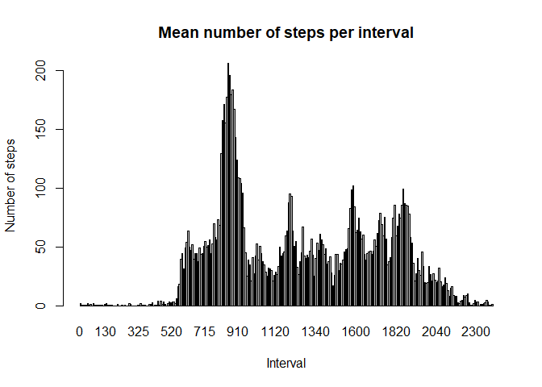

```r
# load required packages
require(tidyverse)
require(dplyr)
require(ggplot2)
require(lubridate)
```

## Loading and preprocessing the data

```r
# read data
unzip("activity.zip")
activitydata <- read_csv("activity.csv")

activitydata$date <- 
        activitydata$date %>%
        ymd() # formate date with lubridate

# group by date
activitydata <- group_by(activitydata, date)

# get mean no. of steps per date
steps_day <- 
        summarise(activitydata, 
                  mean = mean(steps, 
                              na.rm = TRUE),
                  total = sum(steps,
                              na.rm = TRUE))
```

## What is mean and median total number of steps taken per day?

The mean and median total daily steps are calculated and shown below.


```r
mean(steps_day$total, na.rm = TRUE)
```

```
## [1] 9354.23
```

```r
median(steps_day$total, na.rm = TRUE)
```

```
## [1] 10395
```

A histogram of daily step counts is shown below


```r
hist(steps_day$total,
     breaks = c(seq(from = 0, to = 25000, by = 2500)),
     ylim = c(0,20),
     main = "Daily step count",
     xlab = "Total steps per day")
```

<!-- -->

## What is the average daily activity pattern?

```r
# group by time interval
activitydata <- group_by(activitydata, interval)

steps_interval <-
        summarise(activitydata,
                  mean = mean(steps,
                              na.rm = TRUE))

# produce a plot of mean no. of steps per time interval
barplot(steps_interval$mean,
        names.arg = steps_interval$interval,
        xlab = "Interval",
        ylab = "Number of steps",
        main = "Mean number of steps per interval")
```

<!-- -->

```r
# identify the interval with the highest mean no. of steps

steps_interval %>%
        filter(mean == max(mean)) %>%
        select(interval)
```

```
## # A tibble: 1 x 1
##   interval
##      <dbl>
## 1      835
```

The above shows that interval 835 has the highest mean number of steps out of all the intervals.

## Imputing missing values

The number of rows with missing data is calculated below.


```r
# count number of rows with missing data
sum(is.na(activitydata$steps))
```

```
## [1] 2304
```

Next, missing "steps" values are replaced by the mean value of steps for that particular interval. The imputed data is stored in a new dataframe called "activity_impute".


```r
# impute missing data

activity_impute <- activitydata

for(i in 1:nrow(activity_impute)) {
        if(is.na(activity_impute[i,"steps"])) {
                intv <- as.numeric(activity_impute[i,"interval"])
                activity_impute[i,"steps"] = as.numeric(steps_interval[steps_interval$interval==intv,"mean"])
        }
}
```

For the new imputed data, the below code will summarise daily step counts, calculate mean and median daily step counts and produce a histogram.


```r
# group by date
activity_impute <- group_by(activity_impute, date)

# summarise total steps per day

imputed_steps_day <- summarise(activity_impute,
                               total = sum(steps))

# report mean and median daily step counts of imputed data

mean(imputed_steps_day$total)
```

```
## [1] 10766.19
```

```r
median(imputed_steps_day$total)
```

```
## [1] 10766.19
```

```r
# produce a histogram

hist(imputed_steps_day$total,
     breaks = c(seq(from = 0, to = 25000, by = 2500)),
     ylim = c(0,25),
     main = "Daily step count (imputed data)",
     xlab = "Total steps per day")
```

<!-- -->

As you can see, the mean and median total steps per day increase after imputation. Additionally, from the histogram you can see that the distribution of the data becomes more normally distributed. There is a big drop in the frequency of days with total steps between 0-2500.

## Are there differences in activity patterns between weekdays and weekends?
